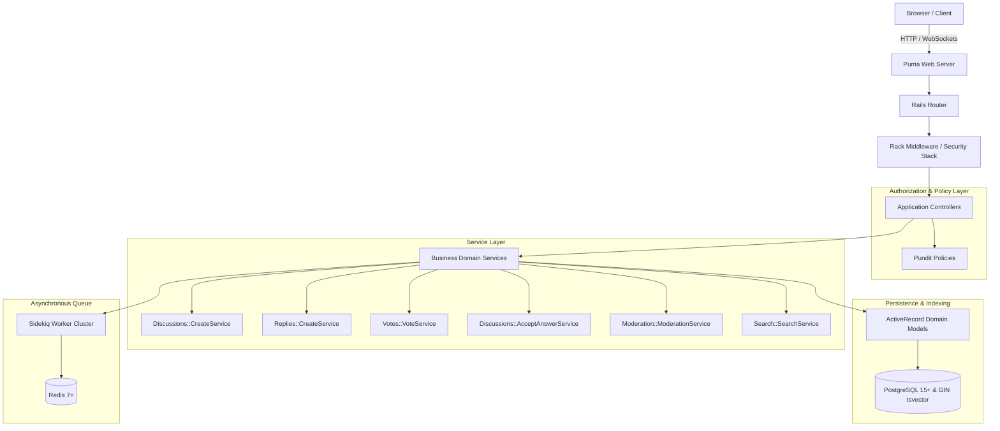

# FORUMX Architectural Blueprint

## 1. System Architecture Overview

FORUMX is engineered as a modern, high-performance web platform built on **Ruby on Rails 8**, adhering strictly to clean architecture principles, server-rendered reactivity via **Hotwire (Turbo & Stimulus)**, and a modular service layer.

---

## 2. Layered Architecture

### 2.1 The Request Lifecycle
1. **HTTP Routing & Ingress**: Incoming requests pass through security headers, Rack attack throttling, and Devise session authentication.
2. **Pundit Authorization**: Before performing any mutation or rendering restricted data, controllers invoke `authorize record, :action?`.
3. **Domain Services**: Business logic does not leak into controllers or bloated ActiveRecord models. Dedicated service objects orchestrate complex operations across multiple tables.
4. **ActiveRecord Validations & Callbacks**: Ensure referential integrity and maintain counter caches (`replies_count`, `discussions_count`, `vote_score`).
5. **Hotwire Responses**: Actions respond with either standard HTML redirects (for page-level flows) or Turbo Streams (`*.turbo_stream.erb`) for instantaneous partial DOM updates without a full page refresh.

---

## 3. Hotwire Reactive Component Architecture

### 3.1 Turbo Frames
- **Collapsible Threads**: Sub-trees of replies are scoped within contextual frames.
- **In-place Reply Form**: When clicking "Reply" on a nested reply, a Stimulus controller clones or mounts the reply form directly beneath that message within the DOM tree.

### 3.2 Turbo Streams
- **Instant Voting**: Upvoting or downvoting replaces the targeted discussion/reply vote badge and updates the user's active state via Turbo Stream replacements.
- **Bookmarks & Subscriptions**: Real-time toggle actions updating counts and button states.

### 3.3 Stimulus Controllers
- **`dropdown_controller.js`**: Accessible user and moderation menu toggles with click-outside listener.
- **`flash_controller.js`**: Auto-dismissing and animated toast notification system.
- **`nested_reply_controller.js`**: Injects reply target inputs and adjusts parent reply IDs dynamically.
- **`reply_collapse_controller.js`**: Toggles expansion and collapsing of reply trees with visual indicators.
- **`mobile_menu_controller.js`**: Accessible responsive sidebar and navigation drawer for handheld devices.

---

## 4. Background Processing & Concurrency

- **Sidekiq Cluster**: Handles asynchronous badge verification, mention notification dispatches, and email transmissions.
- **Redis Connection Pooling**: Manages persistent connection queues configured in `config/initializers/sidekiq.rb` and `config/sidekiq.yml`.
- **Zero-Downtime Worker Compatibility**: Jobs are idempotent and parameterized with record IDs rather than serialized ActiveRecord objects.
