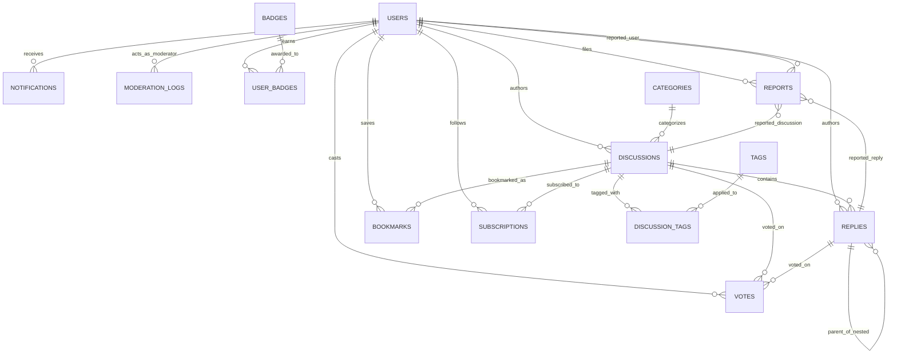

# FORUMX Database Architecture & Schema Specification

## 1. Relational Entity-Relationship Diagram



---

## 2. Table Specifications & Primary Keys

### `users`
| Column | Type | Constraints & Indices | Description |
| :--- | :--- | :--- | :--- |
| `id` | `bigint` | Primary Key | Standard surrogate key |
| `email` | `string` | Unique, Not Null | Normalized Devise authentication email |
| `username` | `string` | Unique, Not Null | Unique handle (`@username`) used in routing & mentions |
| `display_name`| `string`| Nullable | Preferred public name |
| `role` | `integer`| Default `0` (User) | Enum: `0: user`, `1: moderator`, `2: admin` |
| `reputation` | `integer`| Default `0`, Indexed | Accumulated karma through upvotes and accepted answers |
| `suspended_at`| `datetime`| Nullable, Indexed | Timestamp of active administrative suspension |
| `discussions_count` | `integer` | Default `0` | Denormalized counter cache |
| `replies_count` | `integer` | Default `0` | Denormalized counter cache |

### `categories`
| Column | Type | Constraints & Indices | Description |
| :--- | :--- | :--- | :--- |
| `id` | `bigint` | Primary Key | |
| `name` | `string` | Unique, Not Null | Category title |
| `slug` | `string` | Unique, Not Null, Indexed | URL parameter identifier |
| `color` | `string` | Default `#3B82F6` | Hex code for badge accent styling |
| `icon` | `string` | Default `folder` | Feather icon identifier |
| `discussions_count` | `integer` | Default `0` | Denormalized counter cache |

### `discussions`
| Column | Type | Constraints & Indices | Description |
| :--- | :--- | :--- | :--- |
| `id` | `bigint` | Primary Key | |
| `user_id` | `bigint` | Foreign Key -> `users(id)`, ON DELETE CASCADE | Author |
| `category_id` | `bigint` | Foreign Key -> `categories(id)`, ON DELETE RESTRICT | Assigned community category |
| `title` | `string` | Not Null, Max 180 chars | Discussion headline |
| `slug` | `string` | Unique, Not Null, Indexed | Parameterized URL slug |
| `body` | `text` | Not Null | Markdown content |
| `status` | `integer` | Default `0` (Open) | Enum: `0: open`, `1: locked`, `2: archived` |
| `pinned` | `boolean` | Default `false`, Indexed | Featured discussion flag |
| `views_count` | `integer` | Default `0` | Atomic read counter |
| `replies_count` | `integer` | Default `0` | Direct & nested reply count |
| `vote_score` | `integer` | Default `0`, Indexed | Sum of all upvotes (+1) and downvotes (-1) |
| `accepted_reply_id` | `bigint` | Nullable, Foreign Key -> `replies(id)` | Marked solution reply |

### `replies` (Hierarchical Adjacency List)
| Column | Type | Constraints & Indices | Description |
| :--- | :--- | :--- | :--- |
| `id` | `bigint` | Primary Key | |
| `discussion_id` | `bigint` | Foreign Key -> `discussions(id)`, ON DELETE CASCADE | Parent discussion |
| `user_id` | `bigint` | Foreign Key -> `users(id)`, ON DELETE CASCADE | Author |
| `parent_reply_id`| `bigint` | Nullable, Foreign Key -> `replies(id)`, ON DELETE CASCADE | Self-referential pointer for nested replies |
| `body` | `text` | Not Null | Markdown content |
| `status` | `integer` | Default `0` (Visible) | Enum: `0: visible`, `1: removed` |
| `vote_score` | `integer` | Default `0` | Sum of all votes |

---

## 3. Polymorphic Voting Engine

The `votes` table utilizes a compound unique index across polymorphic targets:
```ruby
t.references :user, null: false, foreign_key: true
t.references :voteable, polymorphic: true, null: false
t.integer :value, null: false # -1 or 1
t.index [:user_id, :voteable_type, :voteable_id], unique: true
```
- **Atomicity**: Changes to votes are enclosed within explicit database transactions (`ActiveRecord::Base.transaction`).
- **Integrity**: Users cannot double-vote; re-clicking the same vote toggles the record to destruction and restores author reputation.

---

## 4. PostgreSQL Full-Text Search (GIN Index)

Full-text searching is implemented natively using PostgreSQL `tsvector` and `tsquery`.

### Migration Index:
```sql
CREATE INDEX index_discussions_on_fts ON discussions
USING gin(to_tsvector('english', coalesce(title, '') || ' ' || coalesce(body, '')));
```

### Query Mechanics (`Search::SearchService`):
```ruby
sanitized = query.gsub(/[^a-zA-Z0-9\s]/, "").strip.split(/\s+/).map { |t| "#{t}:*" }.join(" & ")

discussions.where(
  "to_tsvector('english', coalesce(discussions.title, '') || ' ' || coalesce(discussions.body, '')) @@ to_tsquery('english', ?)",
  sanitized
).order(Arel.sql("ts_rank(...) DESC"))
```
This enables prefix matching (`auth*` matches `authentication`), stopword removal, and relevance ranking with zero external search dependencies like Elasticsearch.
