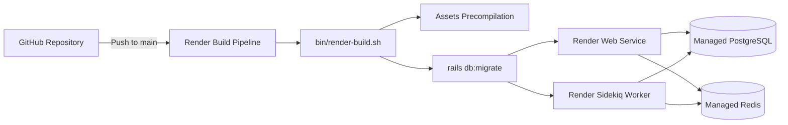

# FORUMX Production Deployment Guide (Render)

## 1. Zero-Docker Production Deployment Overview

FORUMX is optimized for high performance on **Render** using native Ruby and Linux runtimes without Docker containers.

The deployment infrastructure is specified declaratively in [render.yaml](file:///Users/amitabhmorey/Documents/2026/rough/tt/render.yaml).



---

## 2. Deploying via Render Blueprint (`render.yaml`)

### Step 1: Connect GitHub Repository
1. Log in to your [Render Dashboard](https://dashboard.render.com).
2. Click **New +** -> **Blueprint**.
3. Connect your FORUMX GitHub repository and select the target branch (`main`).

### Step 2: Review Generated Resources
Render reads `render.yaml` and will provision:
1. **`forumx-postgres`**: PostgreSQL Database (`forumx_production`).
2. **`forumx-redis`**: Managed Redis Instance.
3. **`forumx-web`**: Ruby Web Service running Puma.
4. **`forumx-sidekiq`**: Asynchronous background job worker.

### Step 3: Configure Environment Variables
Ensure the following variables are populated in the Render dashboard:

| Variable | Source / Value | Description |
| :--- | :--- | :--- |
| `RAILS_ENV` | `production` | Production environment mode |
| `RAILS_SERVE_STATIC_FILES` | `true` | Enables Puma to serve precompiled assets |
| `SECRET_KEY_BASE` | Auto-generated or `rails secret` | Cookie & session encryption key |
| `DATABASE_URL` | Linked from `forumx-postgres` | PostgreSQL connection string |
| `REDIS_URL` | Linked from `forumx-redis` | Redis connection string |
| `WEB_CONCURRENCY` | `2` | Puma clustered workers |
| `RAILS_MAX_THREADS` | `5` | Threads per Puma worker |

### Step 4: Click Apply
Render automatically executes:
```bash
./bin/render-build.sh
```
which runs `bundle install`, compiles Tailwind CSS & static assets, cleans old builds, and runs pending database migrations.

---

## 3. Post-Deployment Database Seeding

To load the realistic demo data (25 users, 52 discussions, 330+ replies, categories, badges) into your production instance:

1. In the Render Dashboard, navigate to your **`forumx-web`** service.
2. Click **Shell**.
3. Run the following command:
   ```bash
   bundle exec rails db:seed
   ```
4. Log into your production app using any of the demo accounts:
   - `admin@forumx.io` / `Password123!`
   - `moderator@forumx.io` / `Password123!`
   - `user@forumx.io` / `Password123!`

---

## 4. Health Checks & Monitoring

- **Uptime Healthcheck Route**: `/up` (returns HTTP 200 with OK status when database and app are healthy).
- **Log Streaming**: Puma logs are piped directly to standard output (`RAILS_LOG_TO_STDOUT=true`) and visible in the Render logs viewer.
